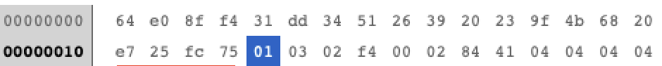
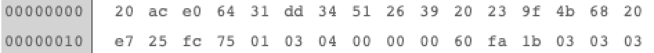

# Edilkamin_BT

This Arduino-ESP32 project allows to connect to Edilkamin pellet stoves via Bluetooth and automatically integrate it with Home Assistant. The cloud dependency is thus eliminated. 

I was able to reverse-engineer the Bluetooth protocol for the essential functions. This was not easy at the beginning, because the communication from cell phone to oven was encrypted via AES. Fortunately the necessary info was found in the source code of the app ;-)

I wrote the code for my Slide2 7-UP pellet stove, but actually all stoves from Edilkamin should work, which are controlled via "The mind".

If you want to try the code, you should include the code as Visual-Studio Code Platform-IO-Project via the Github URL. 

Afterwards you have to adjust the WLAN settings and the MQTT connection in the main.cpp. Don't forget to change the platform.io file and edit your ESP32 board here.

Once you have compiled the code and put it on your ESP32 board, the rest should work automatically. The ESP will search for the pellet stove via the corresponding Bluetooth characteristics and automatically add it to Home-Assistant via the MQTT discovery function.

## Limitations:

Currently only fan 1 can be changed, because my Slide2 does not have more fans. Some special functions like Chrono-timer and Pelletsensor are missing, cause i cant find the necessary codes for this.

I have no idea if this works on your pellet stoves right away, because I could only try it on my stove here. I am curious about the feedback...

## Bluetooth protocol details

Here is an example of a packet sent from the phone to the stove:

Service-UUID is "abf0", the phone sends write-commands to UUID "abf1", the response from the stove comes in at UUID "abf2".

This is an response from the stove to the phone:

As you can see the payload is always 32 bit long. The payload is AES encrypted. 

The decrypted payload looks like this (write from phone to stove):

The first 4 bytes is the actual timestamp. The next 16 Bytes is a static-key which never changes. The next 6 Bytes is the "real" payload - these are modbus-commands. Followed by 2 bytes CRC (0x84 0x41) and 4 bytes padding (0x04).

The response from the stove looks like this:

First 4 bytes is the timestamp, followed by the 16 bytes "static key". The next 7 bytes are the "real" modbus-response, followed by 2 bytes CRC (0xfa 0x1b) and 3 bytes padding (0x03). CRC is CRC16-Modbus.

There are mainly two modbus command-types: "query" and "set". Query always starts with "0x01 0x03", set starts with "0x01 0x06".

