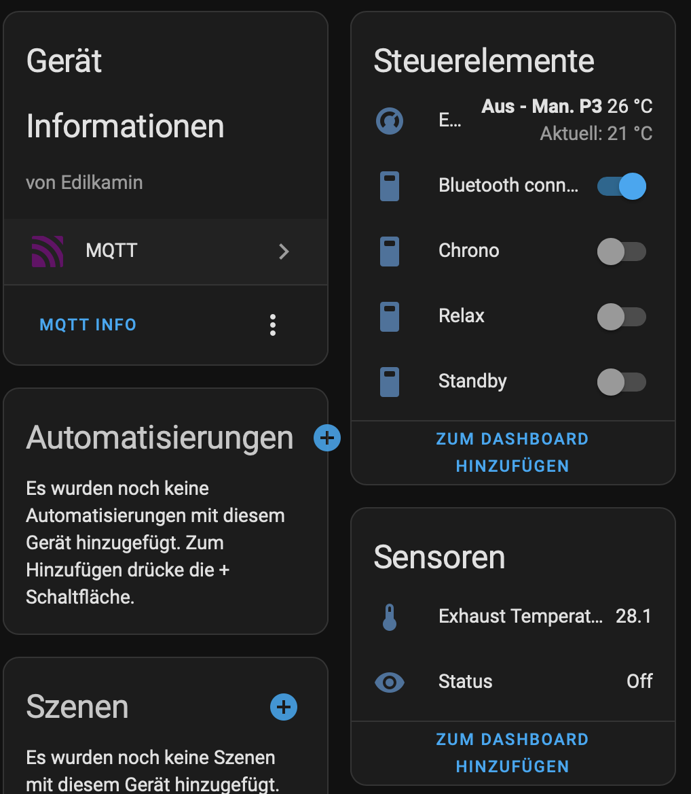
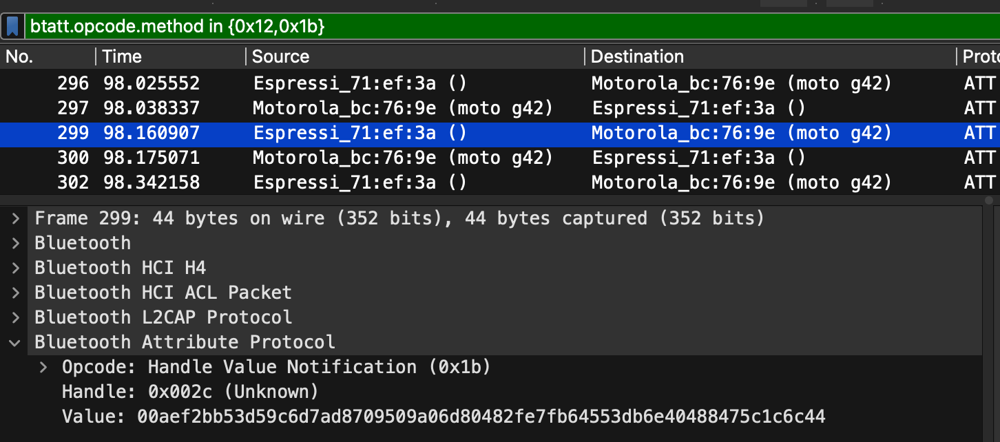
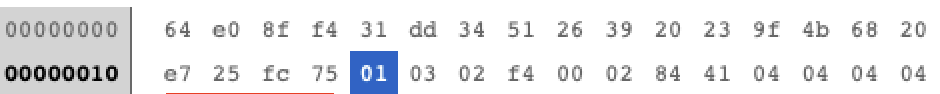

# Edilkamin_BT:

This Arduino-ESP32 project allows to connect to Edilkamin pellet stoves via Bluetooth and automatically integrate it in Home Assistant. The cloud dependency is thus eliminated. 

As the Bluetooth debug has shown, the payload is AES encrypted. Fortunately the necessary keys were found in the source code of the app ;-)

I wrote the code for my Slide2 7-UP pellet stove, but actually all stoves from Edilkamin should work, which are controlled via "The mind".

## Installation:

!! Webflash currenty only works with Wemos D1 Mini ESP32 !!

The current web installer offers **2026.10.29-test1**. Its cold function test on
one single-fan stove passed on 2026-10-29, including independent register readback
and restoration. Fan 2/3 hardware, combustion and long-duration stability remain
untested. See [hardware validation](docs/hardware-validation.json).
Choose **Update** for an existing installation with this repository's partition
layout; do not select erase if you want to preserve configuration. **New install**
uses the merged image and requires Wi-Fi/MQTT configuration afterwards.

Install Firmware with the following URL: https://netmb.github.io/Edilkamin_BT/webflash/

Please ensure that the boot button on the ESP32 is pressed when establishing the USB connection.
If everything has worked, you should see an initial configuration Wi-Fi network called “Edilkamin_BT_AP.” Please connect to this Wi-Fi network and enter the necessary connection parameters. After the reset, the ESP32 will attempt to connect to the stove. Please do not forget that the stove must be put into pairing mode when connecting for the first time! If that also works, you will find a new device in Home Assistant.

 

## Current limitations:

Fan 1, Fan 2 and Fan 3 are supported, depending on the stove configuration reported by the controller. Fan 2/3 support was derived from The Mind 1.3.6 and still needs verification on a stove with additional fans. Some special functions like programming the Chrono timer are not implemented.

I have no idea if this works on your pellet stoves right away, because I could only try it on my stove here. I'm looking forward to your feedback.

## Fan detection and Home Assistant

The firmware follows The Mind Android app: it reads Modbus register `0x0548`
with `01 03 05 48 00 01` and decodes the **low byte** of the response value
(`payload[4]`). This is a configuration code, not always a literal fan count:

| Code | Available fan controls |
| --- | --- |
| 0 | None |
| 1 | Fan 1 |
| 2 | Fan 1 and Fan 2 |
| 3 | Fan 1, Fan 2 and Fan 3 |
| 4 | Fan 2 and Fan 3; Fan 1 disabled (special configuration) |
| Other / unknown | No fan commands accepted until a supported configuration is read |

The raw reported code is published on
`edilkamin/322707E4/fan_configuration/state` for diagnostics.

Fan 1 remains in the existing climate entity. When detected, Fan 2 and Fan 3
appear as MQTT **select** entities named `Fan 2` and `Fan 3` on the same Edilkamin
device. The climate fan control is removed when Fan 1 is absent. Confirmed absent
additional fans have their retained discovery entries removed. Temporary failure
to detect the configuration leaves existing additional entities unavailable.
Discovery is retained and is republished after MQTT reconnect and on
`homeassistant/status = online`.

| Fan | Command topic | State topic |
| --- | --- | --- |
| 1 | `edilkamin/322707E4/fan_mode/set` | `edilkamin/322707E4/fan_mode/state` |
| 2 | `edilkamin/322707E4/fan2_mode/set` | `edilkamin/322707E4/fan2_mode/state` |
| 3 | `edilkamin/322707E4/fan3_mode/set` | `edilkamin/322707E4/fan3_mode/state` |

All accept exactly `20%`, `40%`, `60%`, `80%`, `100%`, or `Auto`. These represent
levels 1–5 and automatic mode 6, not measured RPM percentages. Invalid payloads,
including `0` and `OFF`, are rejected. The Android BLE UI also does not send
zero as a requested speed. Send command messages **without retain**; the new HA
selects do this automatically. Additional-fan state and discovery messages are
retained.

Manual fan commands are blocked while Relax is active. The new select entities
are unavailable in that mode and become available again when Relax is off.
Their availability combines `edilkamin/322707E4/bridge/availability` (MQTT last
will) and `edilkamin/322707E4/fan2_mode/availability` or `fan3_mode/availability`.
The existing periodic Bluetooth sleep remains in place. After initial detection,
commands received during sleep wake the connection; before writing, the firmware
refreshes the equipment code, Relax state and shared fan registers. An uncertain
write (timeout/error/disconnect) cancels pending additional-fan commands and
invalidates the cached partner values. Re-read and send the command again.

Fan 2 and Fan 3 share **one** register, `0x052A`:

```text
Read:   01 03 05 2A 00 01
Write:  01 06 05 2A FAN3 FAN2
```

Changing one fan preserves the other. Pending additional-fan changes are combined
at transmission time; requests arriving while a write is in flight are applied
after its matching echo. A known partner value of zero is preserved, even though
zero is not offered as a new speed. Read responses use `payload[3]` for Fan 3 and
`payload[4]` for Fan 2; write echoes use `[4]` and `[5]`. The Relax register is
`0x052B`, **not** Fan 3. The existing CRC and AES/BLE framing are reused.

The app additionally reads `0x0549` / `0x054A` for fan sensor/environment
assignments. Those describe the assigned temperature input, not the basic fan
presence decision. This firmware uses the fan setpoints at `0x0529` / `0x052A`,
not the machine-output registers the app displays during Relax.

## Control corrections and additional sensors

The bridge reads `0x031C` immediately before an ON/OFF write, changes only bit 0
and preserves the other control bits (including AirKare). Chrono ON/OFF similarly
reads `0x0522` first and preserves its program byte. A failed prerequisite cancels
the dependent write. Manual presets confirm Automatic OFF (`0523 = 0001`) before
writing the selected power and the existing Fan 1 value. Commands remain in arrival
order. Standby ON now uses the app's `052C = 0100` packet and matching echo.

MQTT switch commands accept only `ON` / `OFF`; HVAC accepts only `heat` / `off`.
Temperatures are decimal Celsius in **5..35 °C**, matching the inspected app's
validation range. For example, `24`, `24.0` and `24.00` all write 240; `24.50`
writes 245. Invalid, out-of-range or sub-tenth-degree input is rejected without a
write. HA offers the same range with its existing 0.5 °C step. Room temperature
uses both register bytes, including zero readings; exhaust temperature preserves
one decimal place. The inspected app treats these measurements as unsigned
16-bit tenths; model-specific sentinel/negative-temperature encodings remain
unverified.

Polling `0x031C` synchronizes the HVAC mode after app/panel/timer changes. Status
now includes final cleaning and all three known ignition cleaning substates;
unknown combinations produce a fresh text containing the raw codes.

The following MQTT topics are published with retained state and HA discovery:

| Topic under `edilkamin/322707E4/` | Value | Source |
| --- | --- | --- |
| `alarm_code/state` | Decimal current alarm code, without guessed description | `02E6`, high byte |
| `warning_flags/state` | Eight hex digits, all four bytes in wire order | `02F4`, two registers |
| `pellet_reserve/state` | `ON` / `OFF` | Bit 2 of the second warning data byte |
| `channel2_temperature/state` | Celsius, one decimal | `02EA` |
| `channel3_temperature/state` | Celsius, one decimal | `02EB` |
| `status_code/state` | `main/sub` in decimal | `02E4`, low/high byte |

Channel reads are enabled for the corresponding detected fan configuration;
these are environment/channel readings, not exhaust or fan motor temperatures.
Each sensor is discovered only after its first valid reply. Its corresponding
`.../availability` becomes `OFFLINE` on a failed read or after ten minutes without
a valid sample. The bridge LWT is also required for HA availability. Cached data
survives normal BLE sleep; broker reconnect and HA startup republish discovery
and the current sample. After ESP restart old retained sensor states remain
unavailable until fresh readings arrive.

**Compatibility:** the existing `pellet_level/state` topic now reports `Reserve`
instead of `Empty` when the reserve bit is set, including when other flags are
also set. Update automations that compare the old `Empty` text, or use the new
`pellet_reserve` binary sensor. The bit is not a measured empty tank or percentage.
Warning flags include operating/function flags, so a nonzero raw block must not
be interpreted as a generic alarm. Alarm descriptions and other individual warning
bit meanings are not inferred.

The climate entity waits for reported states and no longer retains commands.
Previously retained commands in a broker are not automatically removed.
BLE timeouts reset the connection before another request; Modbus read replies
carry no register address, so retrying and then processing delayed duplicate
responses could associate a reading with the wrong command. Unconfirmed writes
are not automatically repeated. Read-modify-write is serialized by this bridge,
but the protocol provides no atomic compare-and-swap against simultaneous changes
from another controller.

This extension uses only short reads/writes supported by the existing 32-byte
transport. Channel setpoint controls (including the ambiguous channel-3 read),
alarm history, statistics, weekly schedules and hydraulic sensors remain outside
this change. The build itself never uploads firmware or performs a live stove test. The
separate single-fan cold test is documented in the hardware-validation report.

## Release packaging

`bash build_webflash.sh` builds and packages the firmware, verifies the image
layout, and generates both manifests plus SHA-256 build metadata. It does **not**
commit, push or flash. Set `PIO_CMD`, `PIO_PYTHON` and `PLATFORMIO_CORE_DIR` when
using a custom PlatformIO installation. The Python interpreter needs the
esptool dependencies supplied by PlatformIO.

The default `webflash/manifest.json` writes only the application at `0x10000`.
`manifest-full.json` installs a merged DIO/40MHz/4MB image including bootloader,
partitions and OTA initialization. New-install images overwrite the NVS area;
use the update option to preserve an existing configuration. Both installation
dialogs expose the erase choice. `build-info.json` identifies source hashes,
binary hashes and the validation scope for that exact firmware SHA-256. The firmware reports
its version over serial and `edilkamin/322707E4/firmware_version/state`.

The Android app does not show the bridge's periodic 30s/120s BLE cooldown in the
examined paths: it polls visible BLE screens every 5s, serializes requests,
disconnects on a 15s response timeout and closes BLE when the activity stops.
The observed 2-minute app timer is a cloud check. The bridge's empirically useful
pauses remain unchanged. See [static APK timing analysis](docs/android-ble-timing.txt).

## Build and tests

```sh
pio run -e wemos_d1_mini32
bash tests/run_host_tests.sh
```

The PlatformIO platform is pinned to `espressif32@6.12.0`, using Arduino-ESP32
2.0.17 with the existing NimBLE-Arduino 1.x API. The firmware binary is generated
at `.pio/build/wemos_d1_mini32/firmware.bin`.

The native tests require a C++11 compiler with AddressSanitizer/UBSan and the
ArduinoJson headers installed by PlatformIO (or set `ARDUINOJSON_INCLUDE`). They
cover configuration codes, coupled writes, in-flight updates, reconnect/timeout
handling, Relax, zero partner values, Modbus CRC/echo validation and HA discovery
JSON. Additional regression tests exercise decimal temperatures, shared-register
preservation, prerequisite failures, warning combinations and status decoding.
`tests/extract_firmware.py` compiles the actual MQTT callback, queue/dispatch and
response-processing functions from `main.cpp` into a host harness with mocked AES
and BLE. Python 3 is required for this harness. It does not exercise hardware,
encryption, timing or the complete Arduino loop. These tests do not replace a
hardware test. Building does not flash the ESP32 or
publish the web flasher binaries.

## Bluetooth protocol details:

Here is an example of a packet sent from the phone to the stove:


Service-UUID is "abf0", the phone sends write-commands to UUID "abf1", the response from the stove comes in at UUID "abf2".

This is an response from the stove to the phone:



The short request/response examples used by this bridge are 32 bytes long and AES encrypted. Larger app operations require longer frames and are not supported by this transport.

The decrypted payload looks like this (write from phone to stove):



The first 4 bytes is the actual timestamp. The next 16 Bytes is a static-key which never changes. The next 6 Bytes is the "real" payload - these are modbus-commands. Followed by 2 bytes CRC (0x84 0x41) and 4 bytes padding (0x04).

The response from the stove looks like this:


First 4 bytes is the timestamp, followed by the 16 bytes "static key". The next 7 bytes are the "real" modbus-response, followed by 2 bytes CRC (0xfa 0x1b) and 3 bytes padding (0x03). CRC is CRC16-Modbus.

There are mainly two modbus command-types: "query" and "set". Query always starts with "0x01 0x03", set starts with "0x01 0x06".


