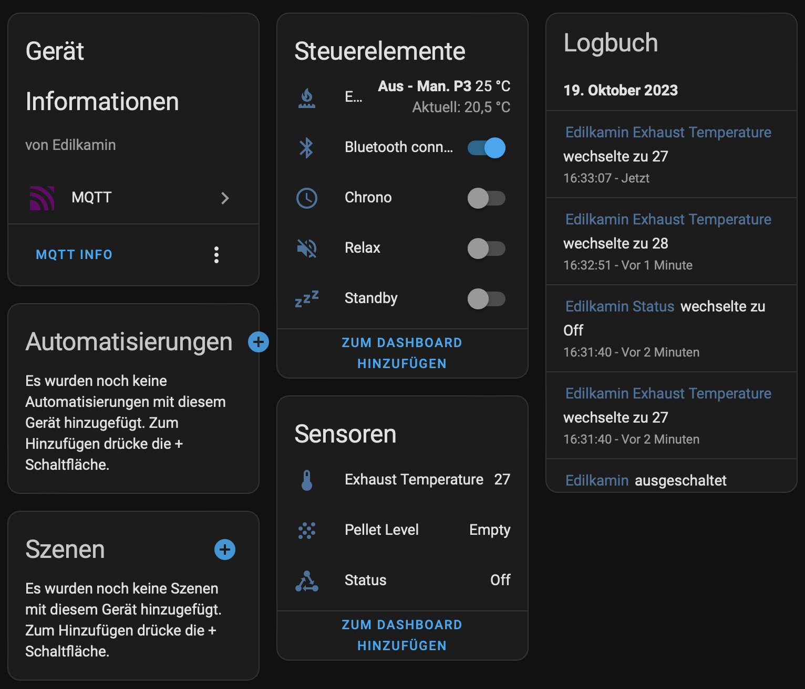

# Edilkamin_BT:

This Arduino-ESP32 project allows to connect to Edilkamin pellet stoves via Bluetooth and automatically integrate it in Home Assistant. The cloud dependency is thus eliminated. 

As the Bluetooth debug has shown, the payload is AES encrypted. Fortunately the necessary keys were found in the source code of the app ;-)

I wrote the code for my Slide2 7-UP pellet stove, but actually all stoves from Edilkamin should work, which are controlled via "The mind".

## Installation:

!! Webflash currenty only works with Wemos D1 Mini ESP32 !!

Install Firmware with the following URL: https://netmb.github.io/Edilkamin_BT/webflash/

Please ensure that the boot button on the ESP32 is pressed when establishing the USB connection.
If everything has worked, you should see an initial configuration Wi-Fi network called “Edilkamin_BT_AP.” Please connect to this Wi-Fi network and enter the necessary connection parameters. After the reset, the ESP32 will attempt to connect to the stove. Please do not forget that the stove must be put into pairing mode when connecting for the first time! If that also works, you will find a new device in Home Assistant.

 

## Current limitations:

Currently only fan 1 can be changed, because my Slide2 does not have more fans. Some special functions like Chrono-timer are missing, cause i cant find the necessary codes for this.

I have no idea if this works on your pellet stoves right away, because I could only try it on my stove here. I'm looking forward to your feedback.

## Bluetooth protocol details:

Here is an example of a packet sent from the phone to the stove:

Service-UUID is "abf0", the phone sends write-commands to UUID "abf1", the response from the stove comes in at UUID "abf2".

This is an response from the stove to the phone:

As you can see the payload is always 32 bit long. The payload is AES encrypted. 

The decrypted payload looks like this (write from phone to stove):

The first 4 bytes is the actual timestamp. The next 16 Bytes is a static-key which never changes. The next 6 Bytes is the "real" payload - these are modbus-commands. Followed by 2 bytes CRC (0x84 0x41) and 4 bytes padding (0x04).

The response from the stove looks like this:

First 4 bytes is the timestamp, followed by the 16 bytes "static key". The next 7 bytes are the "real" modbus-response, followed by 2 bytes CRC (0xfa 0x1b) and 3 bytes padding (0x03). CRC is CRC16-Modbus.

There are mainly two modbus command-types: "query" and "set". Query always starts with "0x01 0x03", set starts with "0x01 0x06".

